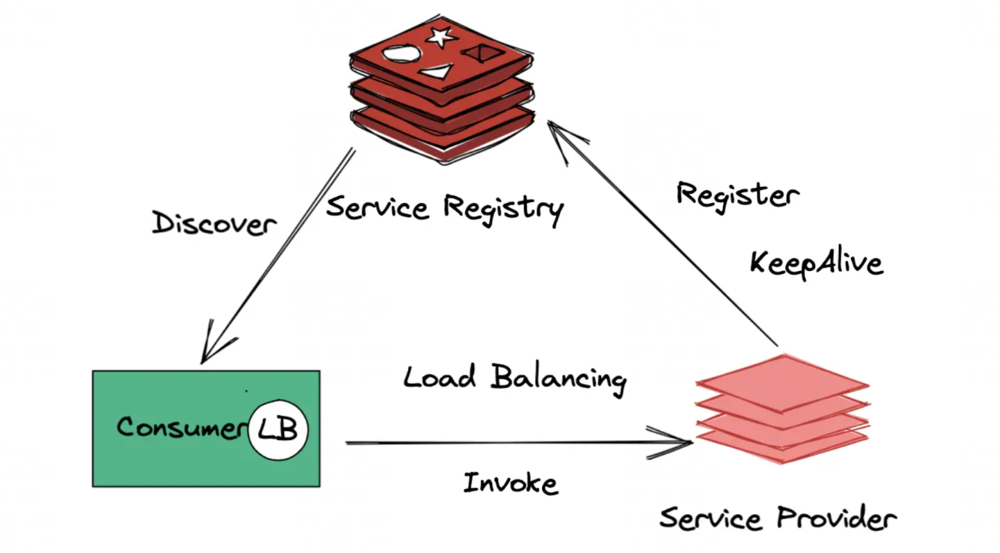
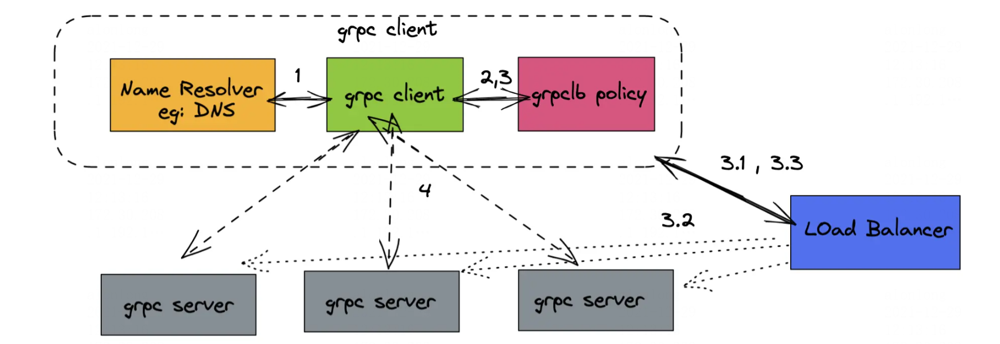

### Service Discovery



There are three components to Service Discovery: **the service provider**, **the service consumer** and **the service registry.**

- The Service Provider registers itself with the service registry and keep it alive when it enters the system, and de-registers itself when it leaves the system.

- The Service Consumer gets the location of a provider from the service registry, and then connects it to the service provider.

- The Service Registry is a database that contains the network locations of service instances. The service registry needs to be highly available and up to date so clients can go through network locations obtained from the service registry. A service registry consists of a cluster of servers that use a replication protocol to maintain consistency.

### GRPC load balancer



Client-side load balancing is configured when a channel is created. The two components to consider when using load balancing:

- The resolver, which resolves the addresses for the channel. Resolvers support getting addresses from an external source. This is also known as service discovery.
- The load balancer, which creates connections and picks the address that a gRPC call will use.

### Examples

#### installation

1. download the golang
```
$ wget https://go.dev/dl/go1.17.5.linux-amd64.tar.gz
$ tar xvf go1.17.5.linux-amd64.tar.gz
$ mv go /usr/local/

$ mkdir -p $HOME/project/go/src
$ mkdir -p $HOME/project/go/pkg

# configure the go environment in .bash_profile or .zshrc
export GOROOT=/usr/local/go
export GOPATH=$HOME/project/go
export PATH=$PATH:$GOROOT/bin:$GOPATH/bin:/usr/local/bin
export GOPROXY=https://goproxy.cn

$ source .bash_profile or source .zshrc 
```

2. download the etcd
```
$ wget https://github.com/etcd-io/etcd/releases/download/v3.5.1/etcd-v3.5.1-linux-amd64.tar.gz
$ tar xvf etcd-v3.5.1-linux-amd64.tar.gz
$ cp etcd-v3.5.1-linux-amd64/etcd* /usr/local/bin  # add the /usr/local/bin to PATH
```

3. download the protoc
```
$ wget https://github.com/protocolbuffers/protobuf/releases/download/v3.19.1/protoc-3.19.1-linux-x86_64.zip
$ unzip protoc-3.19.1-linux-x86_64.zip
$ cp bin/protoc /usr/local/bin  # add the /usr/local/bin to PATH
```

4. install the tool: grpc-gen-go
```
go get -u github.com/golang/protobuf/{proto,protoc-gen-go}
```

5. cp and extract discovery.tar to "$HOME/project/go/src"
```
$ cd $HOME/project/go/src
$ tar xvf discovery.tar
$ cd discovery
$ go mod tidy
$ make

$ ./discovery
Run the 'serve' subcommand to start the grpc server

Usage:
  discovery [command]

Available Commands:
  client      Request the grpc server
  help        Help about any command
  server      Start the grpc server

Flags:
  -h, --help   help for discovery

Use "discovery [command] --help" for more information about a command.
```

#### start the etcd (etcd/start.sh)
**replace 172.30.217.163 with local ip address**
```
$ cd $HOME/project/go/src/discovery/etcd
$ etcd --name default \
 --listen-peer-urls="http://172.30.217.163:2380" \
 --listen-client-urls="http://172.30.217.163:2379,http://127.0.0.1:2379" \
 --advertise-client-urls="http://172.30.217.163:2379"
```

#### start the grpc server
```
$ cd $HOME/project/go/src/discovery
$ ./discovery server
```

#### start the grpc client
```
$ cd $HOME/project/go/src/discovery
$ ./discovery client
```
